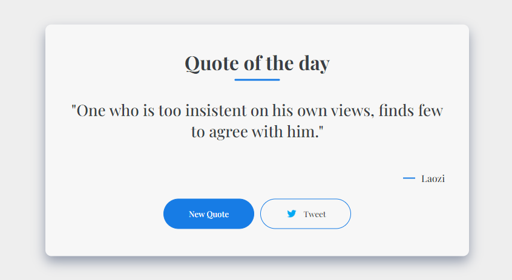

# Quote Generator

## Description 

This quote generator brings inspiration to your fingertips. Get inspired with a click of a button as it randomly generates motivational quotes. With a sleek design and seamless functionality, this web application sparks creativity and motivation, making it perfect for daily doses of inspiration.

## Authors

- [Mannath Shaik](https://www.github.com/mannath93478) 

## Demo

Live Demo:

https://mannath-quote-generator.netlify.app/

## Getting Started

To explore or modify the code, follow these steps:

1.Clone the repository

2.Open the project in your preferred code editor.

3.Make changes to the HTML, CSS, or JavaScript files as desired.

4.Test the changes locally.

5.Deploy the updated website to your preferred hosting platform.

## Features

1. Random Quote Generation: Experience a fresh dose of inspiration with every refresh. This quote generator randomly generates motivational quotes, ensuring that you never run out of uplifting messages. Each quote is accompanied by the author's name, adding credibility and context to the wisdom being shared.

2. New Quote Button: Take control of your inspiration journey with the ability to fetch a new quote at your convenience. Simply click the "New Quote" button, and the generator will provide you with a brand new quote and author combination, giving you endless possibilities for inspiration.

3. Tweet Functionality: Share your favorite quotes with the world using the integrated tweet button. With a single click, you can instantly share a quote along with the author's name on Twitter, spreading positivity and motivation to your followers. Amplify the impact of meaningful quotes by easily sharing them on social media.

## 🔗 Links

For any questions or inquiries, please feel free to reach out. 

Mannath Shaik :

Thank you for visiting the page!
